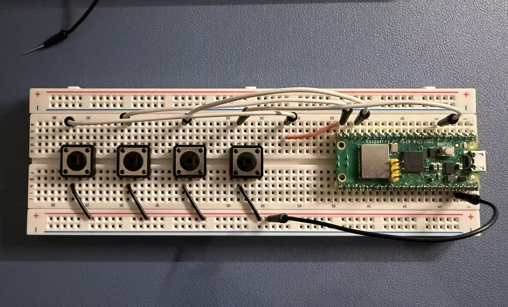

# Custom Macropad for League of Legends

## Overview
Designing and building a custom macropad using a Raspberry Pi Pico W. The macropad supports QWER keys for League of Legends Gameplay. A joystick will also be included to allow for the panning of camera during the game.

## Project Roadmap

- [x] Prototype button circuit on a breadboard
- [x] Test each switch and verify wiring
- [ ] Develop firmware for button detection and debouncing
- [ ] Implement USB HID keyboard functionality
- [ ] Add macro support
- [ ] Design the schematic in KiCad
- [ ] Route and manufacture the PCB
- [ ] Assemble and test the final board
- [ ] Design and print a case

## Technologies
- C/C++
- CAD
- Raspberry Pi Pico SDK
- KiCad
- Git
- USB HID