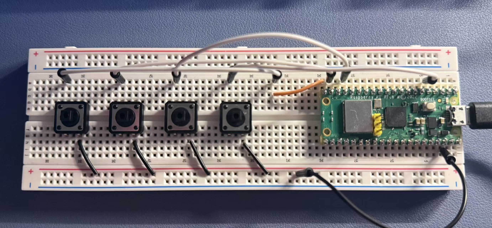

# Custom Macropad for League of Legends

## Overview

This project implements a custom USB macropad using the Raspberry Pi Pico W.
The macropad is designed for League of Legends, providing dedicated QWER ability
keys and a joystick for camera movement. The firmware is written in C using the
Raspberry Pi Pico SDK, and the final hardware will be designed in KiCad and
manufactured as a custom PCB.

## Project Roadmap

- [x] Prototype button circuit on a breadboard
- [x] Test each switch and verify wiring
- [x] Develop firmware for button detection and debouncing
- [ ] Implement USB HID keyboard functionality
- [ ] Add macro support
- [ ] Design the schematic in KiCad
- [ ] Route and manufacture the PCB
- [ ] Assemble and test the final board
- [ ] Design and print a case

## Technologies
- C/C++
- CAD (3D Printed Case)
- Raspberry Pi Pico SDK
- TinyUSB
- KiCad
- Git
- VS Code

## Button Module Specifications

### Purpose

The button module provides an interface for initializing and scanning the macropad's pushbuttons. It abstracts the GPIO hardware and reports button press and release events.

### Functional Requirements
- Initialize all configured GPIO pins as digital inputs.
- Enable the Raspberry Pi Pico's internal pull-up resistors.
- Scan all buttons periodically.
- Detect button press events.
- Detect button release events.
- Generate exactly one press event for each physical press.
- Generate exactly one release event for each physical release.

### Assumptions
- Buttons are active-low.
- One side of every switch is connected to a GPIO pin.
- The opposite side is connected to ground.
- Internal pull-up resistors are enabled.
- buttons_scan() is called periodically from the main loop.